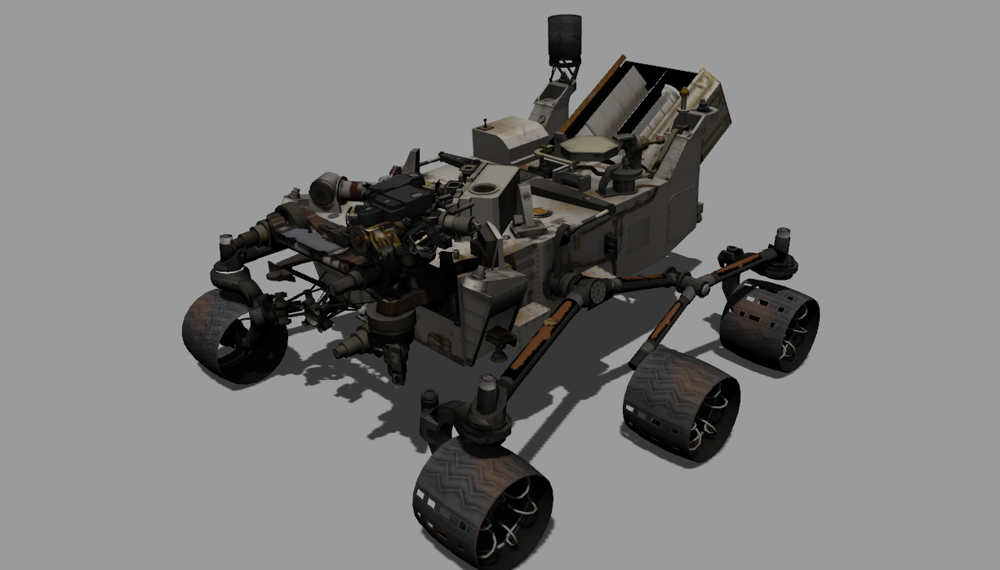
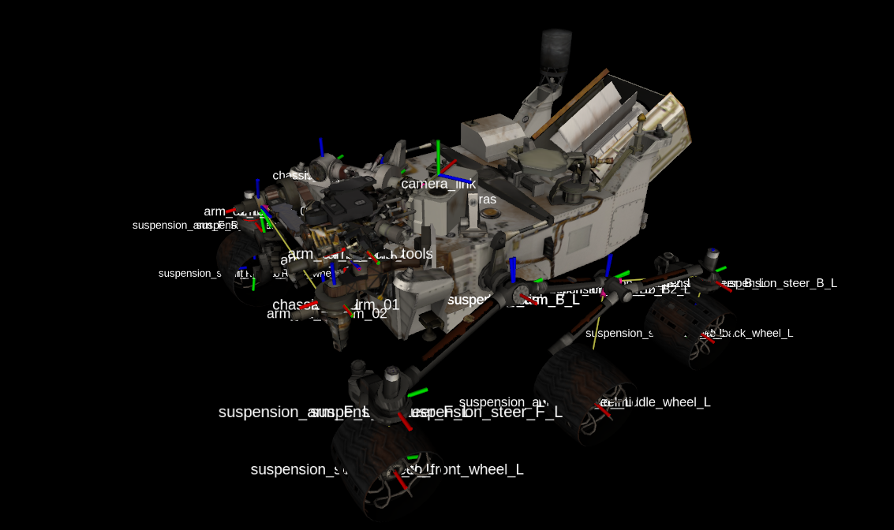

# curiosity_mars_rover_description
This repository contains the curiosity mars rover simulation in gazebo.
## Simulation Platform
This workspace is tested with Ubuntu 18.04, ROS Melodic and Gazebo9.
<p align="center">
    
</p>

## Build the workspace
Build the workspace:
```
cd ~/catkin_ws/src
git clone https://github.com/ArghyaChatterjee/curiosity_mars_rover_description.git
cd ~/catkin_ws
catkin_make
```

## Launch the simulation
Launch the simulation:
```
cd catkin_ws
source devel/setup.bash
roslaunch curiosity_mars_rover_description main_simple.launch
```
You can see the following:
<p align="center">
    
</p>

Launch another simulation:
```
cd catkin_ws
source devel/setup.bash
roslaunch curiosity_mars_rover_description main_real_mars.launch
```

Curiosity has only one nav camera. Now try to see the topics:
```
arghya@arghya-Erazer-X7849-MD60379:~/catkin_ws$ rostopic list
/clicked_point
/clock
/cmd_vel
/curiosity_mars_rover/arm_01_joint_position_controller/command
/curiosity_mars_rover/arm_01_joint_position_controller/pid/parameter_descriptions
/curiosity_mars_rover/arm_01_joint_position_controller/pid/parameter_updates
/curiosity_mars_rover/arm_01_joint_position_controller/state
/curiosity_mars_rover/arm_02_joint_position_controller/command
/curiosity_mars_rover/arm_02_joint_position_controller/pid/parameter_descriptions
/curiosity_mars_rover/arm_02_joint_position_controller/pid/parameter_updates
/curiosity_mars_rover/arm_02_joint_position_controller/state
/curiosity_mars_rover/arm_03_joint_position_controller/command
/curiosity_mars_rover/arm_03_joint_position_controller/pid/parameter_descriptions
/curiosity_mars_rover/arm_03_joint_position_controller/pid/parameter_updates
/curiosity_mars_rover/arm_03_joint_position_controller/state
/curiosity_mars_rover/arm_04_joint_position_controller/command
/curiosity_mars_rover/arm_04_joint_position_controller/pid/parameter_descriptions
/curiosity_mars_rover/arm_04_joint_position_controller/pid/parameter_updates
/curiosity_mars_rover/arm_04_joint_position_controller/state
/curiosity_mars_rover/arm_tools_joint_position_controller/command
/curiosity_mars_rover/arm_tools_joint_position_controller/pid/parameter_descriptions
/curiosity_mars_rover/arm_tools_joint_position_controller/pid/parameter_updates
/curiosity_mars_rover/arm_tools_joint_position_controller/state
/curiosity_mars_rover/back_wheel_L_joint_velocity_controller/command
/curiosity_mars_rover/back_wheel_L_joint_velocity_controller/pid/parameter_descriptions
/curiosity_mars_rover/back_wheel_L_joint_velocity_controller/pid/parameter_updates
/curiosity_mars_rover/back_wheel_L_joint_velocity_controller/state
/curiosity_mars_rover/back_wheel_R_joint_velocity_controller/command
/curiosity_mars_rover/back_wheel_R_joint_velocity_controller/pid/parameter_descriptions
/curiosity_mars_rover/back_wheel_R_joint_velocity_controller/pid/parameter_updates
/curiosity_mars_rover/back_wheel_R_joint_velocity_controller/state
/curiosity_mars_rover/front_wheel_L_joint_velocity_controller/command
/curiosity_mars_rover/front_wheel_L_joint_velocity_controller/pid/parameter_descriptions
/curiosity_mars_rover/front_wheel_L_joint_velocity_controller/pid/parameter_updates
/curiosity_mars_rover/front_wheel_L_joint_velocity_controller/state
/curiosity_mars_rover/front_wheel_R_joint_velocity_controller/command
/curiosity_mars_rover/front_wheel_R_joint_velocity_controller/pid/parameter_descriptions
/curiosity_mars_rover/front_wheel_R_joint_velocity_controller/pid/parameter_updates
/curiosity_mars_rover/front_wheel_R_joint_velocity_controller/state
/curiosity_mars_rover/joint_states
/curiosity_mars_rover/mast_02_joint_position_controller/command
/curiosity_mars_rover/mast_02_joint_position_controller/pid/parameter_descriptions
/curiosity_mars_rover/mast_02_joint_position_controller/pid/parameter_updates
/curiosity_mars_rover/mast_02_joint_position_controller/state
/curiosity_mars_rover/mast_cameras_joint_position_controller/command
/curiosity_mars_rover/mast_cameras_joint_position_controller/pid/parameter_descriptions
/curiosity_mars_rover/mast_cameras_joint_position_controller/pid/parameter_updates
/curiosity_mars_rover/mast_cameras_joint_position_controller/state
/curiosity_mars_rover/mast_p_joint_position_controller/command
/curiosity_mars_rover/mast_p_joint_position_controller/pid/parameter_descriptions
/curiosity_mars_rover/mast_p_joint_position_controller/pid/parameter_updates
/curiosity_mars_rover/mast_p_joint_position_controller/state
/curiosity_mars_rover/middle_wheel_L_joint_velocity_controller/command
/curiosity_mars_rover/middle_wheel_L_joint_velocity_controller/pid/parameter_descriptions
/curiosity_mars_rover/middle_wheel_L_joint_velocity_controller/pid/parameter_updates
/curiosity_mars_rover/middle_wheel_L_joint_velocity_controller/state
/curiosity_mars_rover/middle_wheel_R_joint_velocity_controller/command
/curiosity_mars_rover/middle_wheel_R_joint_velocity_controller/pid/parameter_descriptions
/curiosity_mars_rover/middle_wheel_R_joint_velocity_controller/pid/parameter_updates
/curiosity_mars_rover/middle_wheel_R_joint_velocity_controller/state
/curiosity_mars_rover/odom
/curiosity_mars_rover/suspension_arm_B2_L_joint_position_controller/command
/curiosity_mars_rover/suspension_arm_B2_L_joint_position_controller/pid/parameter_descriptions
/curiosity_mars_rover/suspension_arm_B2_L_joint_position_controller/pid/parameter_updates
/curiosity_mars_rover/suspension_arm_B2_L_joint_position_controller/state
/curiosity_mars_rover/suspension_arm_B2_R_joint_position_controller/command
/curiosity_mars_rover/suspension_arm_B2_R_joint_position_controller/pid/parameter_descriptions
/curiosity_mars_rover/suspension_arm_B2_R_joint_position_controller/pid/parameter_updates
/curiosity_mars_rover/suspension_arm_B2_R_joint_position_controller/state
/curiosity_mars_rover/suspension_arm_B_L_joint_position_controller/command
/curiosity_mars_rover/suspension_arm_B_L_joint_position_controller/pid/parameter_descriptions
/curiosity_mars_rover/suspension_arm_B_L_joint_position_controller/pid/parameter_updates
/curiosity_mars_rover/suspension_arm_B_L_joint_position_controller/state
/curiosity_mars_rover/suspension_arm_B_R_joint_position_controller/command
/curiosity_mars_rover/suspension_arm_B_R_joint_position_controller/pid/parameter_descriptions
/curiosity_mars_rover/suspension_arm_B_R_joint_position_controller/pid/parameter_updates
/curiosity_mars_rover/suspension_arm_B_R_joint_position_controller/state
/curiosity_mars_rover/suspension_arm_F_L_joint_position_controller/command
/curiosity_mars_rover/suspension_arm_F_L_joint_position_controller/pid/parameter_descriptions
/curiosity_mars_rover/suspension_arm_F_L_joint_position_controller/pid/parameter_updates
/curiosity_mars_rover/suspension_arm_F_L_joint_position_controller/state
/curiosity_mars_rover/suspension_arm_F_R_joint_position_controller/command
/curiosity_mars_rover/suspension_arm_F_R_joint_position_controller/pid/parameter_descriptions
/curiosity_mars_rover/suspension_arm_F_R_joint_position_controller/pid/parameter_updates
/curiosity_mars_rover/suspension_arm_F_R_joint_position_controller/state
/curiosity_mars_rover/suspension_steer_B_L_joint_position_controller/command
/curiosity_mars_rover/suspension_steer_B_L_joint_position_controller/pid/parameter_descriptions
/curiosity_mars_rover/suspension_steer_B_L_joint_position_controller/pid/parameter_updates
/curiosity_mars_rover/suspension_steer_B_L_joint_position_controller/state
/curiosity_mars_rover/suspension_steer_B_R_joint_position_controller/command
/curiosity_mars_rover/suspension_steer_B_R_joint_position_controller/pid/parameter_descriptions
/curiosity_mars_rover/suspension_steer_B_R_joint_position_controller/pid/parameter_updates
/curiosity_mars_rover/suspension_steer_B_R_joint_position_controller/state
/curiosity_mars_rover/suspension_steer_F_L_joint_position_controller/command
/curiosity_mars_rover/suspension_steer_F_L_joint_position_controller/pid/parameter_descriptions
/curiosity_mars_rover/suspension_steer_F_L_joint_position_controller/pid/parameter_updates
/curiosity_mars_rover/suspension_steer_F_L_joint_position_controller/state
/curiosity_mars_rover/suspension_steer_F_R_joint_position_controller/command
/curiosity_mars_rover/suspension_steer_F_R_joint_position_controller/pid/parameter_descriptions
/curiosity_mars_rover/suspension_steer_F_R_joint_position_controller/pid/parameter_updates
/curiosity_mars_rover/suspension_steer_F_R_joint_position_controller/state
/gazebo/link_states
/gazebo/model_states
/gazebo/parameter_descriptions
/gazebo/parameter_updates
/gazebo/set_link_state
/gazebo/set_model_state
/initialpose
/mira/camera1/camera_info
/mira/camera1/image_raw
/mira/camera1/image_raw/compressed
/mira/camera1/image_raw/compressed/parameter_descriptions
/mira/camera1/image_raw/compressed/parameter_updates
/mira/camera1/image_raw/compressedDepth
/mira/camera1/image_raw/compressedDepth/parameter_descriptions
/mira/camera1/image_raw/compressedDepth/parameter_updates
/mira/camera1/image_raw/theora
/mira/camera1/image_raw/theora/parameter_descriptions
/mira/camera1/image_raw/theora/parameter_updates
/mira/camera1/parameter_descriptions
/mira/camera1/parameter_updates
/move_base_simple/goal
/rosout
/rosout_agg
/tf
/tf_static
```

## Source
- https://bitbucket.org/theconstructcore/curiosity_mars_rover/src/master/curiosity_mars_rover_description/
- https://github.com/PaTara43/robonomics_sample_controller
- https://wiki.robonomics.network/docs/en/connect-mars-curiosity-rover-under-robonomics-parachain-control/
- https://www.youtube.com/watch?v=6BSOyRbmac8
- https://www.youtube.com/watch?v=fq0DJSbwiZI
